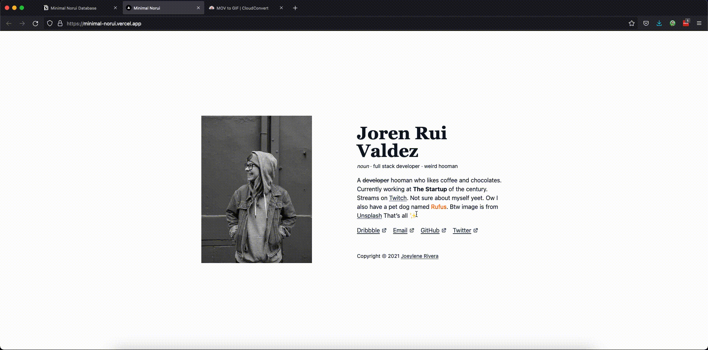

#  Build and Publish to AWS ECR

This GitHub Actions workflow automates the process of building a Docker image and pushing it to both **public and private AWS Elastic Container Registries (ECR)**. It's designed to run every time you push to the `main` branch — making deployment quick, consistent, and hands-off.

---

##  What This Workflow Does

This workflow is made up of **three main steps**, all run in sequence:

1. **Build and prepare for ECR push**
   Checks out the code and sets up AWS credentials.

2. **Push to AWS Public ECR**
   Builds the Docker image, tags it, and pushes it to your public ECR registry.

3. **Push to AWS Private ECR**
   Repeats the build process (for reliability) and pushes to your private ECR.

---

##  Workflow trigger

This workflow is triggered automatically on any push to the `main` branch:

```yaml
on:
  push:
    branches:
      - main
```

---

## Required GitHub Secrets

Make sure these secrets are configured in your GitHub repository:

| Secret Name         | What It's For                     |
| ------------------- | --------------------------------- |
| `AWS_ACCESS_KEY`    | Your AWS access key ID            |
| `AWS_SECRET_ACCESS` | Your AWS secret access key        |
| `AWS_REGION`        | The AWS region (e.g. `us-east-1`) |

---

## Docker Build & Tag

Each Docker image is:

* Built from the `Dockerfile` in your repo root
* Tagged as `latest` locally
* Tagged again with `GITHUB_RUN_ID` (a unique run number)
* Pushed to:

  * Public ECR: `public.ecr.aws/j6x6c3z0/app2ecr:$GITHUB_RUN_ID`
  * Private ECR: `043309324225.dkr.ecr.us-east-1.amazonaws.com/app2ecr:$GITHUB_RUN_ID`

---

## File Layout

Here's a quick look at how things are structured:

```
.github/workflows/
└── build-and-publish.yml  # Main workflow file
Dockerfile                 # Used for building the image
```

---

## ✅ Before You Use It

To make sure everything works smoothly:

* You’ll need AWS credentials with permissions for ECR (both public and private).
* A working Dockerfile at the root of your repository.
* The required secrets set in GitHub settings.

---

## Extra Notes

* The workflow uses the official `aws-actions` and `docker/login-action` GitHub Actions for authentication and image pushing.
* Each job runs on `ubuntu-latest` and is executed in order, ensuring the private push only happens after the public one succeeds.


# Minimal Norui



A minimal norui portfolio example built with NextJS and powered by Notion 🚀.

## Links
- [Demo Site](https://minimal-norui.vercel.app/)
- [Documentation](https://jorenrui.notion.site/Minimal-Norui-168e69403f624b429e7933ce6065b5e7)
- [Minimal Norui Notion Database](https://jorenrui.notion.site/1b1fe86bf57646ad8a774bb0ce7e39fc?v=8112b088197d4b1882437273ea0c98d0)

## Stack

- [TypeScript](https://www.typescriptlang.org/)
- [NextJS](https://nextjs.org/) / [ReactJS](https://reactjs.org/)
- [TailwindCSS](https://tailwindcss.com/)
- [Notion API](https://www.notion.so/)
- Demo site deployed on [Vercel](https://vercel.com/)

## Documentation

You can find the documentation [in this site](https://jorenrui.notion.site/Minimal-Norui-168e69403f624b429e7933ce6065b5e7).

It contains the ff info:
- Why?
- How to use
- [Minimal Norui Notion Database](https://jorenrui.notion.site/1b1fe86bf57646ad8a774bb0ce7e39fc?v=8112b088197d4b1882437273ea0c98d0)

# License

[MIT](https://github.com/jorenrui/norui-minimal/blob/main/LICENSE) © [Joeylene Rivera](https://github.com/jorenrui)
